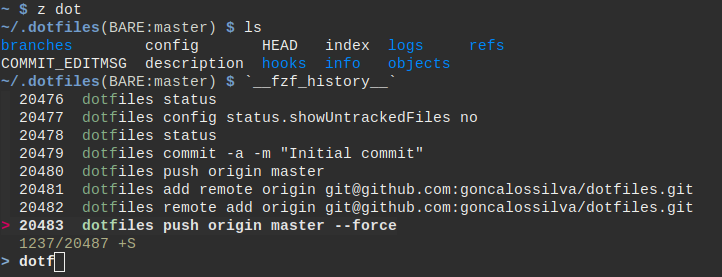

# Gonçalo's dotfiles

This repo contains my dotfiles, used across Linux and macOS.



Nothing is assumed to be installed, but the following are sourced if present:
* [rupa/z](https://github.com/rupa/z) from `~/.z.sh`
* [junegunn/fzf](https://github.com/junegunn/fzf) from `~/.fzf.bash`
* [asdf-vm/asdf](https://github.com/asdf-vm/asdf) and completions from the default locations

# Setup

1. `git clone --bare git@github.com:goncalossilva/dotfiles.git ~/.dotfiles`
2. Source `~/.bashrc` or reload the shell
3. `dotfiles config status.showUntrackedFiles no`

All done. To add something:

```
dotfiles add .vimrc
dotfiles commit -m "Add vimrc"
```

Inspired by [this HN comment](https://news.ycombinator.com/item?id=11071754).
